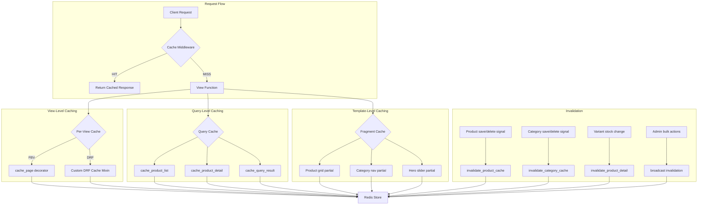
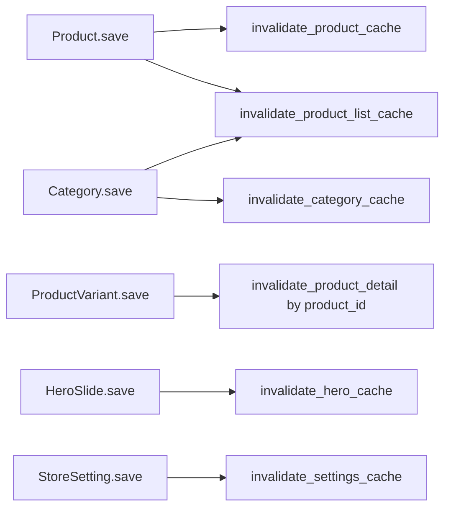
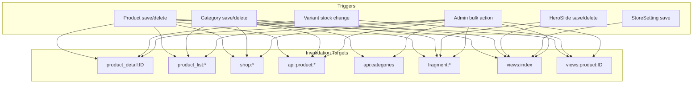

# Redis Caching Strategy for Mohager Store

## Current State

| Component | Status | Issue |
|-----------|--------|-------|
| `django-redis` + `redis` in requirements | ✅ Installed | — |
| Redis cache backend in settings | ✅ Configured | — |
| Cache timeout constants in settings | ✅ Defined | Not referenced anywhere |
| `cache_page` import in store/views.py | ⚠️ Imported | Never used on any view |
| `cache_product_list` decorator | ⚠️ Exists | Never applied to any view |
| `cache_product_detail` decorator | ⚠️ Exists | Broken — assumes `self` first arg for CBV but views are FBV |
| `invalidate_product_cache` | ⚠️ Exists | Never called from signals or admin |
| `invalidate_category_cache` | ⚠️ Exists | Ignores its `category_slug` param |
| DRF API views caching | ❌ Missing | ProductViewSet, CategoryViewSet have zero caching |
| Template fragment caching | ❌ Missing | Expensive blocks re-render every request |
| Search query caching | ❌ Missing | shop view hits DB for every search |
| Cache invalidation signals | ❌ Missing | Admin edits leave stale cache |
| Query optimization | ❌ Missing | No select_related/prefetch_related on product queries |

---

## Architecture Overview



---

## Cache Key Naming Convention

All keys use the prefix `mohager_store` from settings. The full key structure:

```
mohager_store:{domain}:{key_type}:{identifier}
```

| Key Pattern | TTL | Description |
|-------------|-----|-------------|
| `mohager_store:views:index` | 5 min | Homepage full response |
| `mohager_store:views:shop:{query_hash}` | 5 min | Shop page with filters |
| `mohager_store:views:product:{id}` | 10 min | Product detail page |
| `mohager_store:api:products:{query_hash}` | 5 min | DRF product list |
| `mohager_store:api:product:{id}` | 10 min | DRF product detail |
| `mohager_store:api:categories` | 10 min | DRF category list |
| `mohager_store:query:product_list:{hash}` | 5 min | Product queryset |
| `mohager_store:query:product_detail:{id}` | 10 min | Single product + variants + images |
| `mohager_store:query:categories` | 10 min | Category queryset |
| `mohager_store:query:hero_slides` | 10 min | Hero slides queryset |
| `mohager_store:fragment:product_grid` | 5 min | Template fragment |
| `mohager_store:warm:status` | 1 hr | Cache warming lock |

---

## Implementation Plan

### Step 1: Fix and Enhance Cache Utilities — `common/cache.py`

**Changes:**
- Fix `cache_product_detail` to work with function-based views — remove `self` assumption
- Fix `invalidate_category_cache` to actually use the `category_slug` parameter
- Add `cache_key` helper for consistent key generation
- Add `invalidate_all_product_cache` for bulk invalidation
- Add `cache_api_response` decorator specifically for DRF views
- Add `get_or_cache` utility function for manual cache-and-retrieve pattern
- Add `invalidate_hero_cache` for hero slide changes
- Add `invalidate_store_settings_cache` for settings changes

**Key functions to add:**

```python
def get_or_cache(key, func, timeout=300):
    """Get from cache or execute func and cache result."""
    result = cache.get(key)
    if result is not None:
        return result
    result = func()
    cache.set(key, result, timeout)
    return result

def cache_api_response(timeout=300, key_prefix='api'):
    """Decorator for DRF ViewSet actions."""
    # Uses request.get_full_path() for cache key

def invalidate_all_product_cache():
    """Nuclear option — clear all product-related cache."""
    cache.delete_pattern('*product*')
    cache.delete_pattern('*category*')
    cache.delete_pattern('*shop*')
    cache.delete_pattern('*index*')
```

### Step 2: Add Django Signals for Automatic Cache Invalidation — `store/signals.py`

**Changes:**
- Add `post_save` and `post_delete` signals for `Product`
- Add `post_save` and `post_delete` signals for `Category`
- Add `post_save` signal for `ProductVariant` — stock changes invalidate detail cache
- Add `post_save` and `post_delete` signals for `HeroSlide`
- Add `post_save` signal for `StoreSetting`

**Signal flow:**



### Step 3: Apply Caching to Store Views — `store/views.py`

**Changes to each view:**

| View | Strategy | TTL | Key |
|------|----------|-----|-----|
| `index` | `cache_page` + query caching for products/slides | 5 min | `views:index` |
| `shop` | Manual query caching with filter-aware keys | 5 min | `views:shop:{filters_hash}` |
| `product_detail` | `cache_page` + query caching | 10 min | `views:product:{id}` |
| `cart_detail` | No caching — user-specific, always fresh | — | — |
| `checkout` | No caching — transactional, user-specific | — | — |
| `dashboard` | No caching — user-specific orders | — | — |

**For `shop` view** — the key must include filter params so different searches get different cache entries:

```python
def shop(request):
    query = request.GET.get('q', '')
    category_slug = request.GET.get('category', '')
    cache_key = f'shop:{category_slug}:{query}'
    
    products = get_or_cache(
        cache_key,
        lambda: Product.objects.filter(is_active=True)
            .filter(category__slug=category_slug if category_slug else None)
            .filter(Q(name_ar__icontains=query) | ...) if query else None,
        timeout=settings.CACHE_TIMEOUT_PRODUCT_LIST
    )
```

**Also add `select_related`/`prefetch_related`:**
- `index`: `Product.objects.select_related('category').prefetch_related('variants', 'images')`
- `shop`: same as above
- `product_detail`: `Product.objects.select_related('category').prefetch_related('variants', 'images')`

### Step 4: Apply Caching to DRF API Views — `products/views.py`

**Strategy:** Create a `CachedViewSetMixin` in `common/cache.py` that:
1. Caches `list` responses with filter-aware keys
2. Caches `retrieve` responses per-object
3. Invalidates on `create`, `update`, `partial_update`, `destroy`
4. Caches the `related` action on `ProductViewSet`

**Apply to:**
- `ProductViewSet` — list, retrieve, related actions
- `CategoryViewSet` — list, retrieve actions

**Mixin approach:**

```python
class CachedViewSetMixin:
    """Mixin for DRF ViewSets that caches read operations."""
    cache_timeout = 300
    cache_key_prefix = 'api'
    
    def list(self, request, *args, **kwargs):
        # Cache key based on query params + filters
        ...
    
    def retrieve(self, request, *args, **kwargs):
        # Cache key based on pk
        ...
    
    def perform_create(self, serializer):
        super().perform_create(serializer)
        self._invalidate_list_cache()
    
    def perform_update(self, serializer):
        super().perform_update(serializer)
        self._invalidate_detail_cache(serializer.instance.pk)
        self._invalidate_list_cache()
    
    def perform_destroy(self, instance):
        pk = instance.pk
        super().perform_destroy(instance)
        self._invalidate_detail_cache(pk)
        self._invalidate_list_cache()
```

### Step 5: Add Template Fragment Caching — Store Templates

**Templates to add fragment caching:**

| Template | Fragment | Key | TTL |
|----------|----------|-----|-----|
| `store/index.html` | Product grid | `fragment:index_products` | 5 min |
| `store/index.html` | Hero slider | `fragment:hero_slides` | 10 min |
| `store/shop.html` | Product grid | `fragment:shop_products:{category}:{query}` | 5 min |
| `store/shop.html` | Category nav | `fragment:categories` | 10 min |
| `store/product_detail.html` | Product info | `fragment:product:{id}` | 10 min |

**Example template change:**

```html



  <!-- Product grid loop -->
  
    ...
  

```

### Step 6: Query Optimization — `select_related`/`prefetch_related`

**Views that need optimization:**

| View | Current Query | Optimized Query |
|------|---------------|-----------------|
| `index` | `Product.objects.filter(is_active=True)[:8]` | `.select_related('category').prefetch_related('variants', 'images')` |
| `shop` | `Product.objects.filter(is_active=True)` | `.select_related('category').prefetch_related('variants', 'images')` |
| `product_detail` | `Product` + separate `ProductVariant` + `ProductImage` queries | Single `select_related('category').prefetch_related('variants', 'images')` |
| `ProductViewSet` | Already has `prefetch_related` | Add `select_related('category')` |

### Step 7: Cache Warming Celery Task — `common/tasks.py`

**Purpose:** Pre-populate cache on deployment or after cache flush.

**Tasks to create:**

```python
@app.task
def warm_product_cache():
    """Pre-warm product list and detail caches."""
    # Cache all active products list
    # Cache top 50 product details
    # Cache all categories
    # Cache hero slides

@app.task
def warm_homepage_cache():
    """Pre-warm the homepage cache specifically."""
    # Simulate index view request to populate cache
```

**Add to Celery beat schedule** in `config/celery.py`:
- `warm-product-cache`: Every 4 minutes — refreshes before 5-min TTL expires

### Step 8: Update Settings — `config/settings.py`

**Changes:**
- Add `UpdateCacheMiddleware` and `FetchFromCacheMiddleware` to MIDDLEWARE
- Add cache timeout for hero slides and store settings
- Ensure `KEY_PREFIX` is production-safe

```python
MIDDLEWARE = [
    ...
    'django.middleware.cache.UpdateCacheMiddleware',      # ADD — must be near top
    ...
    'django.middleware.cache.FetchFromCacheMiddleware',   # ADD — must be near bottom
    ...
]

# Additional cache timeouts
CACHE_TIMEOUT_HERO_SLIDES = 600   # 10 minutes
CACHE_TIMEOUT_STORE_SETTINGS = 3600  # 1 hour
CACHE_TEMPLATES = True  # Enable template fragment caching
```

### Step 9: Cache Health-Check Management Command — `common/management/commands/cache_status.py`

**Purpose:** Monitor Redis connection, key count, memory usage, and hit/miss ratio.

```python
class Command(BaseCommand):
    def handle(self, *args, **options):
        # Ping Redis
        # Show key count by pattern
        # Show memory usage
        # Show hit/miss stats if available
        # Show TTL distribution
```

---

## Invalidation Strategy Summary



---

## Files to Modify

| File | Change Type | Description |
|------|-------------|-------------|
| `common/cache.py` | Major refactor | Fix decorators, add utilities, add DRF mixin |
| `store/signals.py` | Major addition | Add cache invalidation signals for all models |
| `store/views.py` | Moderate | Apply caching + query optimization |
| `products/views.py` | Moderate | Apply CachedViewSetMixin |
| `store/templates/store/index.html` | Minor | Add fragment cache tags |
| `store/templates/store/shop.html` | Minor | Add fragment cache tags |
| `store/templates/store/product_detail.html` | Minor | Add fragment cache tags |
| `config/settings.py` | Minor | Add cache middleware + new timeout constants |
| `config/celery.py` | Minor | Add cache warming beat schedule |
| `common/tasks.py` | New file | Cache warming Celery tasks |
| `common/management/commands/cache_status.py` | New file | Cache health-check command |

---

## Risk Mitigation

| Risk | Mitigation |
|------|------------|
| Stale cache after admin edits | Django signals auto-invalidate on model save/delete |
| Cache stampede on popular products | Stale-while-revisit pattern — refresh in background, serve stale |
| Redis connection failure | `django-redis` falls back gracefully; views still work without cache |
| Memory overflow in Redis | TTL on all keys; monitor with `cache_status` command |
| Over-caching user-specific data | Only cache public, anonymous views; skip cart/checkout/dashboard |
| Search results showing stale products | Include query params in cache key; invalidate on product changes |
